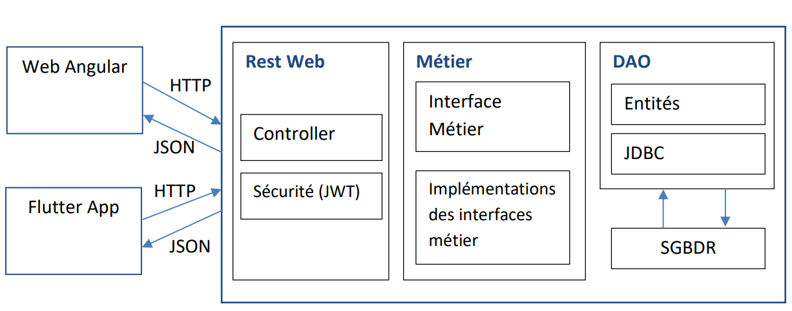
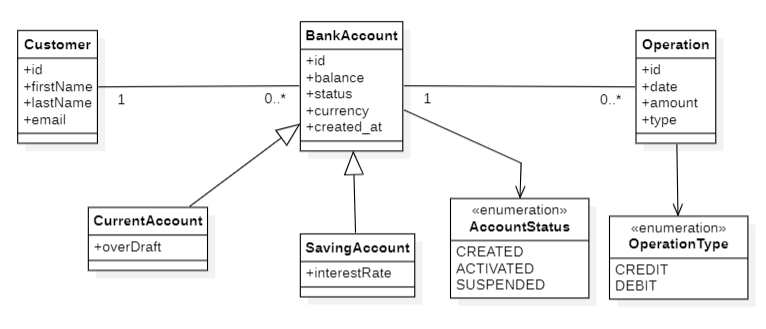
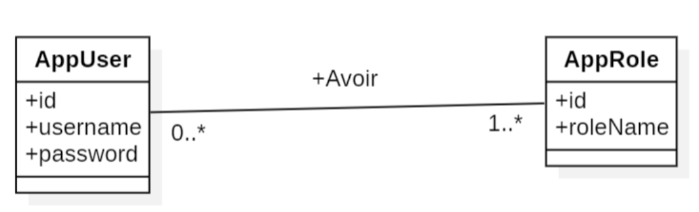
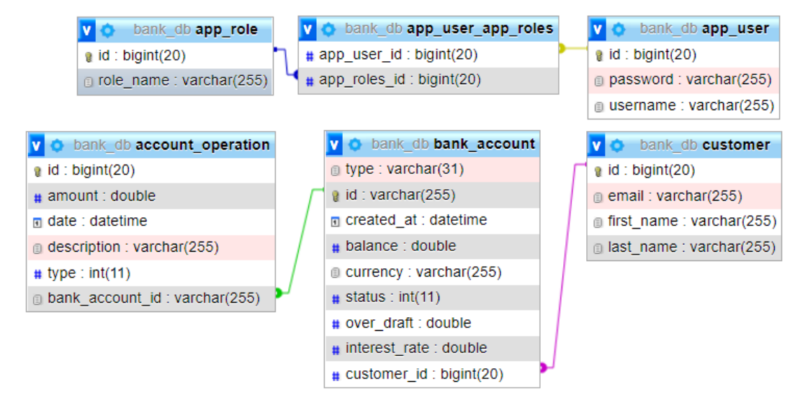
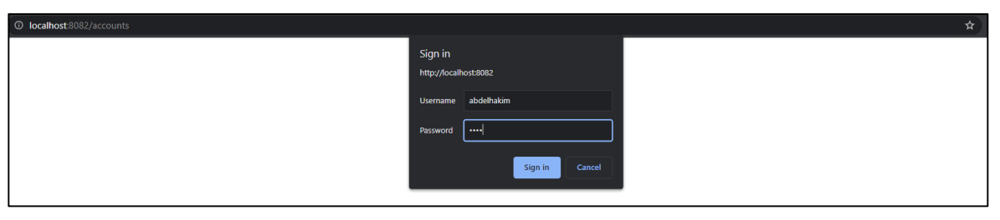
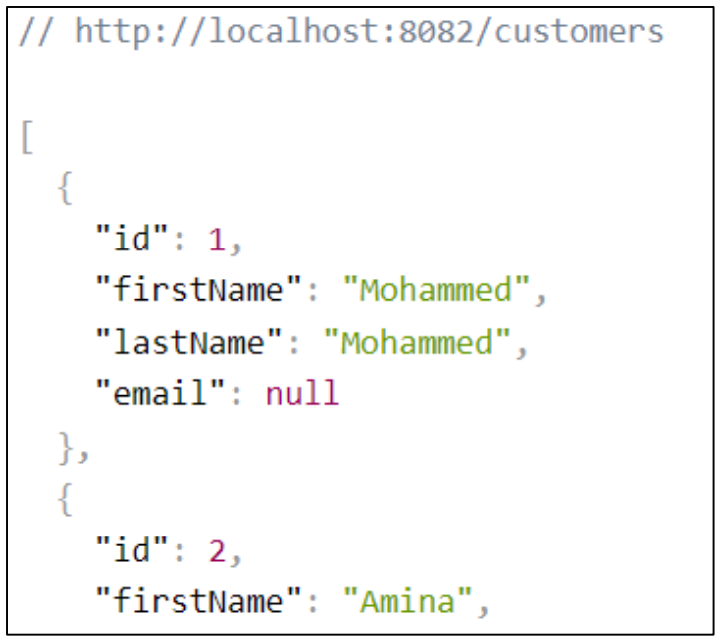
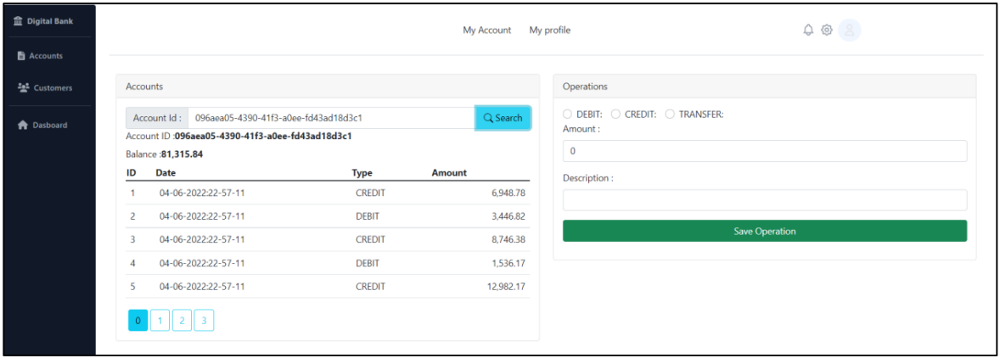
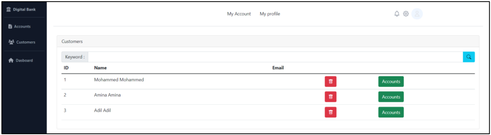

# Digital Banking

Digital Banking est un projet développer sous Spring Framework, et MySQL comme base de données, il consiste à gérer les différentes opérations bancaires à savoir les retraites, les transferts d’argents etc…  
Ce projet est composé de deux parties, une partie backend, et une frontend développer avec Angular Framework et Tailwind CSS.

## Conditions préalables

- [JAVA](https://www.oracle.com/java/technologies/downloads/)
- [MySQL](https://dev.mysql.com/downloads/installer/)
- [Node.js](https://nodejs.org/en/)

## Technologies

- **Backend**: Spring Boot, Spring Security, Spring Data, Lombok, Spring web.
- **Frontend**: HTML5, CSS3, Tailwind, TypeScript, Angular
- **Database**: MySQL

## Déploiement

Pour exécuter ce projet, lancez tout d'abord votre mysql puis lancez le serveur backend.  
Deuxièmement, exécutez l'application frontale en exécutant la commande suivante

```bash
  npm run start
```

En suite vous pouvez accéder à l’application on visite le lien suivant : localhost:4200

## Architecteur de projet

Dans cette partie nous allons voir l’architecteur global de notre système comme montre la figure ci-dessous.



## Conception

Notre système se compose de cinq classes, le diagramme suivant représente les classes indispensables pour remplir les besoins fonctionnels du système.



Comme notre système doit être sécurisé et nous voulons avoir la stratégie des rôles, le diagramme suivant représente les classes nécessaires pour répondre à ces contraints



Notre base de données qui contient tous les entités nécessaires est modélisé comme suite



## Réalisation
Après la conception, cette partie concerne la réalisation de notre système. Notre système
est développé avec Spring Framework comme Backend, et une application web avec Angular
et application mobile avec Flutter comme frontend.  
Pour accéder à notre système nous devons en premier lieu s’authentifier puisque nous
utilisons un système de sécurité base sur le JWT.



Apres l’authentification au système nous pouvons donc accéder aux différents services



Le Frontend web est développer avec le Framework Angular. La première page qui s’affiche
est la page d’authentification dans laquelle l’utilisateur peut s’authentifier.


Ou être rediriger vers une autre page pour créer son compte.


Apres l’authentification si l’utilisateur est un ADMIN il sera redirigé vers la page des comptes
dans laquelle il peut consulter tous les comptes et effectuer les différentes opérations
proposées par le système.



Dans cette page l’administrateur peut rechercher un compte par son identificateur, puis
voire tous l’historique des opérations.  
L’administrateur peut également effectuer les opérations de débit, crédit et transfert on
utilise le formulaire à droite.  
Une page de clients est mise à la disposition de l’administrateur pour consulter tous les
clients qui son inscrit dans le système comme présenter dans la figure suivante.

