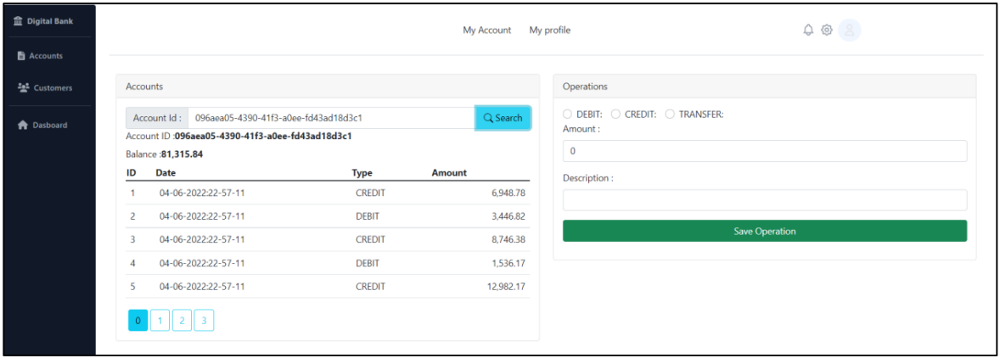
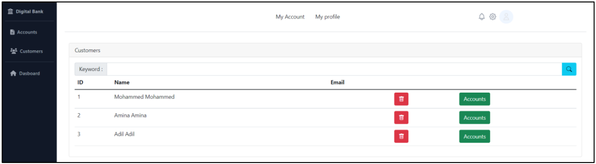

# Digital Banking Frontend

Digital Banking est un projet développer sous Spring Framework, et MySQL comme base de données, il consiste à gérer les différentes opérations bancaires à savoir les retraites, les transferts d’argents etc…  
Ce projet est composé de deux parties, une partie backend, et une frontend développer avec Angular Framework et Tailwind CSS.

## Réalisation

Le Frontend web est développer avec le Framework Angular. La première page qui s’affiche
est la page d’authentification dans laquelle l’utilisateur peut s’authentifier.

Ou être rediriger vers une autre page pour créer son compte.

Apres l’authentification si l’utilisateur est un ADMIN il sera redirigé vers la page des comptes
dans laquelle il peut consulter tous les comptes et effectuer les différentes opérations
proposées par le système.

Dans cette page l’administrateur peut rechercher un compte par son identificateur, puis
voire tous l’historique des opérations.  
L’administrateur peut également effectuer les opérations de débit, crédit et transfert on
utilise le formulaire à droite.  
Une page de clients est mise à la disposition de l’administrateur pour consulter tous les
clients qui son inscrit dans le système comme présenter dans la figure suivante.

## Development server

Run `ng serve` for a dev server. Navigate to `http://localhost:4200/`. The application will automatically reload if you change any of the source files.

## Code scaffolding

Run `ng generate component component-name` to generate a new component. You can also use `ng generate directive|pipe|service|class|guard|interface|enum|module`.

## Build

Run `ng build` to build the project. The build artifacts will be stored in the `dist/` directory.

## Running unit tests

Run `ng test` to execute the unit tests via [Karma](https://karma-runner.github.io).

## Running end-to-end tests

Run `ng e2e` to execute the end-to-end tests via a platform of your choice. To use this command, you need to first add a package that implements end-to-end testing capabilities.

## Further help

To get more help on the Angular CLI use `ng help` or go check out the [Angular CLI Overview and Command Reference](https://angular.io/cli) page.
